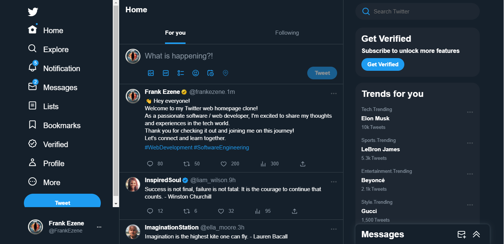

# Twitter Web Home Page Clone

This project is a portfolio project.

## Authors

- [@FrankEzene](https://github.com/frank1003A)

## Screenshot

## Appendix

The Project Employs Practices Like:

- Maintain Clear Folder Structure.
- Institute a Structured Import Order.
- Adhere To Naming Conventions.
- Use a Linter.
- Employ Snippet Libraries.
- Uses Scss.
- Limit Component Creation.

## Features

- Live previews
- Fullscreen mode
- Cross platform
- user management

## Tech Stack

**Client:** React, SCSS, Typescript
